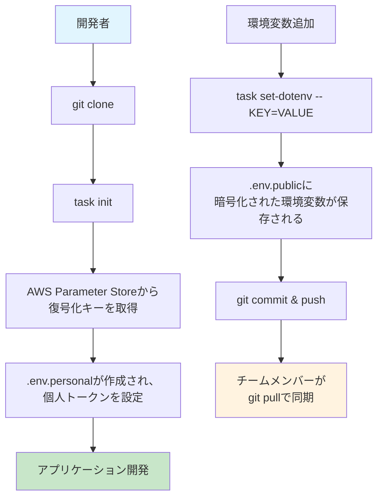

# dotenvx 環境変数管理プロジェクト

🔐 **dotenvx + AWS Parameter Store** で安全な環境変数管理を実現

## 🚀 概要

このプロジェクトは環境変数を暗号化してチーム間で安全に共有するためのシステムです。

**特徴:**

- ✅ 環境変数の暗号化・復号化（dotenvx）
- ✅ 復号化キーを AWS Parameter Store で安全管理
- ✅ 個人トークンとチーム共有設定の分離
- ✅ Taskfile による自動化

## 📁 ファイル構成

```
.
├── Taskfile.yml          # タスク定義ファイル
├── .env.keys            # 復号化キー（🚫 gitignore）
├── .env.personal        # 個人用トークン（🚫 gitignore）
├── .env.public          # チーム共有設定（暗号化対象）
├── .env.vault           # 暗号化済みファイル（✅ git管理OK）
└── README.md
```

## ⚡ クイックスタート

### 1. 前提条件

```bash
# 必要なツールをインストール
npm install -g @dotenvx/dotenvx
brew install go-task/tap/go-task  # macOS
brew install jq
```

### 2. 初期セットアップ

```bash
# リポジトリをクローン
git clone <repository-url>
cd dotenvx-test

# 初期化（AWS Parameter Storeから復号化キーを取得）
task init
```

### 3. 個人設定の追加

```bash
# 個人用トークンを設定（各自で実施）
vim .env.personal
```

`.env.personal`の例:

```bash
GITHUB_TOKEN=ghp_your_personal_token
DATADOG_API_KEY=your_personal_datadog_key
```

## 🔧 使用方法

### 環境変数の追加・更新

**チーム共有設定の追加:**

```bash
# APIキーをチーム全体で共有
task set-dotenv -- API_KEY=your_api_key_here

# データベース設定
task set-dotenv -- DB_HOST=localhost
task set-dotenv -- DB_PORT=5432
```

**個人設定の追加:**

```bash
# .env.personalファイルを直接編集
vim .env.personal
```

### アプリケーションでの使用

```bash
# 環境変数を読み込んでアプリケーション実行
npx dotenvx run -- node app.js

# または、環境変数をエクスポート
npx dotenvx run -- env
```

## 🔄 チーム運用フロー



### 新メンバーのオンボーディング

1. リポジトリをクローン
2. `task init` でセットアップ
3. `.env.personal` に個人トークンを設定
4. すぐに開発開始！

### 環境変数の共有

1. `task set-dotenv -- KEY=VALUE` で共通設定を追加
2. `.env.public` をコミット・プッシュ
3. チームメンバーは `git pull` で同期

## ⚙️ AWS 設定

### Parameter Store 設定

```bash
# パラメータ名: DOTENV_PRIVATE_KEY_PUBLIC
# タイプ: SecureString
# 値: dotenvx生成の復号化キー
```

### AWS プロファイル設定

`Taskfile.yml` の `AWS_PROFILE` を環境に合わせて変更:

```yaml
vars:
  AWS_PROFILE: your-aws-profile-name
```

## 🛠️ トラブルシューティング

### よくあるエラーと解決法

**1. AWS 認証エラー**

```bash
aws configure list
# または
aws sso login --profile your-profile
```

**2. dotenvx コマンドが見つからない**

```bash
npm install -g @dotenvx/dotenvx
```

**3. タスクの引数形式エラー**

```bash
# ✅ 正しい形式
task set-dotenv -- KEY=VALUE

# ❌ 間違った形式
task set-dotenv KEY=VALUE  # -- が抜けている
```

**4. 復号化エラー**

```bash
# 復号化キーを再取得
task init
```

## 🔒 セキュリティ

### ⚠️ 重要な注意事項

**Git にコミットしてはいけないファイル:**

- `.env.keys` - 復号化キー
- `.env.personal` - 個人用トークン

**Git にコミットして良いファイル:**

- `.env.public` - チーム共有設定（暗号化前）
- `.env.vault` - 暗号化済みファイル

### ベストプラクティス

- 🔑 復号化キーは絶対にコミットしない
- 👤 個人用トークンは各自で管理
- 🔐 AWS Parameter Store アクセス権限を適切に設定
- 🔄 定期的な復号化キーローテーション

## 📚 参考リンク

- [dotenvx 公式ドキュメント](https://dotenvx.com/docs/)
- [Taskfile 公式ドキュメント](https://taskfile.dev/)
- [AWS Parameter Store](https://docs.aws.amazon.com/systems-manager/latest/userguide/systems-manager-parameter-store.html)
